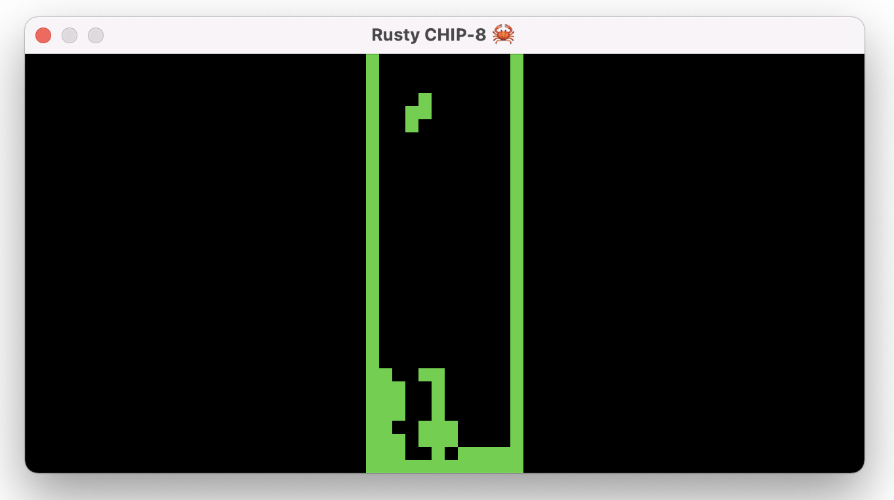

# A *Rusty* CHIP-8 Emulator

> CHIP-8 is an interpreted programming language, developed by Joseph Weisbecker. It was initially used on the COSMAC VIP and Telmac 1800 8-bit microcomputers in the mid-1970s. CHIP-8 programs are run on a CHIP-8 virtual machine.
> — [Wikipedia on CHIP-8](https://en.wikipedia.org/wiki/CHIP-8)

I first wanted to build a GBA emulator, since I've grown up on those, but it seems like a lot for a first-time emulator (and honestly, implementing [every single instruction](https://meganesulli.com/generate-gb-opcodes/) would take forever). I'm also completely new to Rust, so building a CHIP-8 emulator seems like a good place to start. Overall, this is a fantastic systems project to learn a new language (and have something to show at the end of it all).

I primarily tested this emulator on `TETRIS` and `PONG`. Note that it seems like the key debouncer within `minifb` is not the best, so sometimes keys may not be received properly. This is a first time Rust and "building an emulator" project I've done, so expect some quirks.

Some interesting extensions would be to build an interactive debugger (which would involve the user being able to step through opcode instructions and visually look under the hood to examine registers and the stack) and replacing `minifb` with `sdl2` for better abstractions and proper device periphery separation.

### Resources Used:
- [The Rust Programming Language](https://doc.rust-lang.org/book/)
- [Cowgod's Chip-8 Technical Reference](http://devernay.free.fr/hacks/chip8/C8TECH10.HTM#1.0)
- [Colin Eberhardt's WASM Rust Chip-8 Output](https://colineberhardt.github.io/wasm-rust-chip8/web/) 

    *this one helped me make sure my emulator was reading and parsing bits correctly*
- [Why learn Rust at all?](https://www.youtube.com/watch?v=4YU_r70yGjQ)